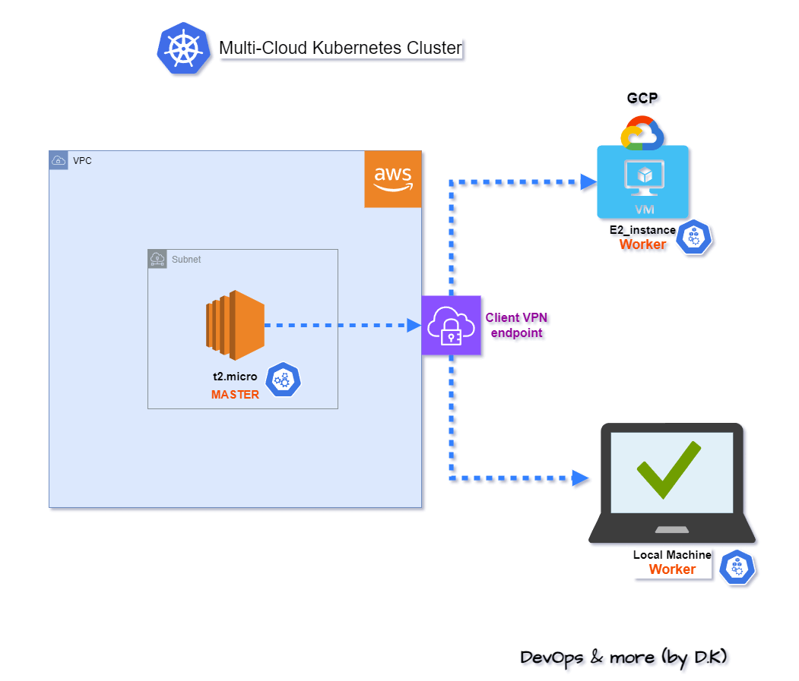

# multi-cloud-kubernetes-cluster
This is to create a multi-cloud cluster by kubeadm using aws client vpn endpoint to put all instances on the same network in order to secure the trafic
The master is an aws ec2  
The workers are the clients of the vpn gcp vm and a local machine  
#### The infrastructure
<p align="center">
  
</p>

### The requirements:
1- AWS account is mandatory to create the vpn endpoint, a GCP account is necessary but not mandatory  
2- Pre-deployed aws ec2:t2.micro not recomended (kubernetes requirements for cpu and memory) but it works if (--ignore-preflight-errors=Mem --ignore-preflight-errors=NumCpu) is specified in kubeadm init  
3- Pre-deployed GCP instance necessary but not mandatory  
4- AWS access key and secret acess key  
5- OS used: Ubuntu 22  
inside scripts you will find the documentation pages for each line
#### Step 0 
Clone this repo  
```  
git clone https://github.com/devops-and-more/multi-cloud-kubernetes-cluster.git
cd multi-cloud-kubernetes-cluster
```
#### Step 1
Generate the certificates/keys for server/client of the vpn endpoint using script1.sh, the script will upload them using aws cli wich will be installed by the script also, it will propmt your aws access/secret keys, make sure to use the region of your aws ec2  
```
chmod +x script1.sh
./script1.sh
```
##### Note:  
script1 is diffrent than the doc in line that begins with command find, this line is equivalent to multiple line in the doc  
#### Step 2
Create your aws vpn endpoints where:  
- Use the vpc of your master(aws_ec2)  
- associated target network: the cidr of the subnet of your master  
- authorization rule: authorize the machines (to be connected to you vpn) acess to the subnet of your master, so enter its cidr in the authorization rule
- Enable split tunnel to do not lose internet connection when you connect your machine to the vpn
#### Step 3  
Download the vpn configuration file, rename/move it to  ~/custom_folder/client.ovpn  
Add the path of certificate and key of the client to the downloaded file somewhere eg: in line  
--cert "[your_home_path]/custom_folder/client1.domain.tld.crt"  
--key "[your_home_path]/custom_folder/client1.domain.tld.key"  
Replace [your_home_path]
copy the directory (custom folder) to the other vpn client machines either manually or if you have ssh access to them from your local use:  
```
scp -r ~/custom_folder [your_vpn_client]:~/custom_folder
```  
#### Step 4  
install client openvpn on the workers (the clients)  
```
sudo apt install -y openvpn
```
Wait until the aws client vpn endpoint is ready, then connect client to it  
```
sudo openvpn --config ~/custom_folder/client.ovpn --daemon
```
--daemon : to run in the background  
#### Step 5
Execute script2.sh on all nodes, this will install and configure all the necessaries to setup the cluster using kubeadm  
You will find inside the script the doc for every line  
So, first copy script2.sh to all nodes then:
```
chmod +x script2.sh
./script2.sh
```
#### Step 6
Initialize the cluster at the master(aws_ec2) using kubeadm (https://kubernetes.io/docs/setup/production-environment/tools/kubeadm/create-cluster-kubeadm/) :  
```
kubeadm init --control-plane-endpoint="[Private IP of the master]:6443" --upload-certs --apiserver-advertise-address=[Private IP of the master] --pod-network-cidr=10.96.0.0/16
```
Run the commands in the output:  
``` 
mkdir -p $HOME/.kube
sudo cp -i /etc/kubernetes/admin.conf $HOME/.kube/config
sudo chown $(id -u):$(id -g) $HOME/.kube/config
``` 
join all other nodes using the join command ouput  
#### Step 7 
install weave https://www.weave.works/docs/net/latest/kubernetes/kube-addon/#-installation 
```
kubectl apply -f https://github.com/weaveworks/weave/releases/download/v2.8.1/weave-daemonset-k8s.yaml
```
### Test the cluster:
Test the cluster by running an nginx pod, then expose it with ClusterIP service, then navigate with your browser to the ip of the service to see the nginx page
```
kubectl run nginx --image nginx --port 80 --expose
#grab the ip of the service
kubectl get svc
# navigate with your browser to that ip
```
